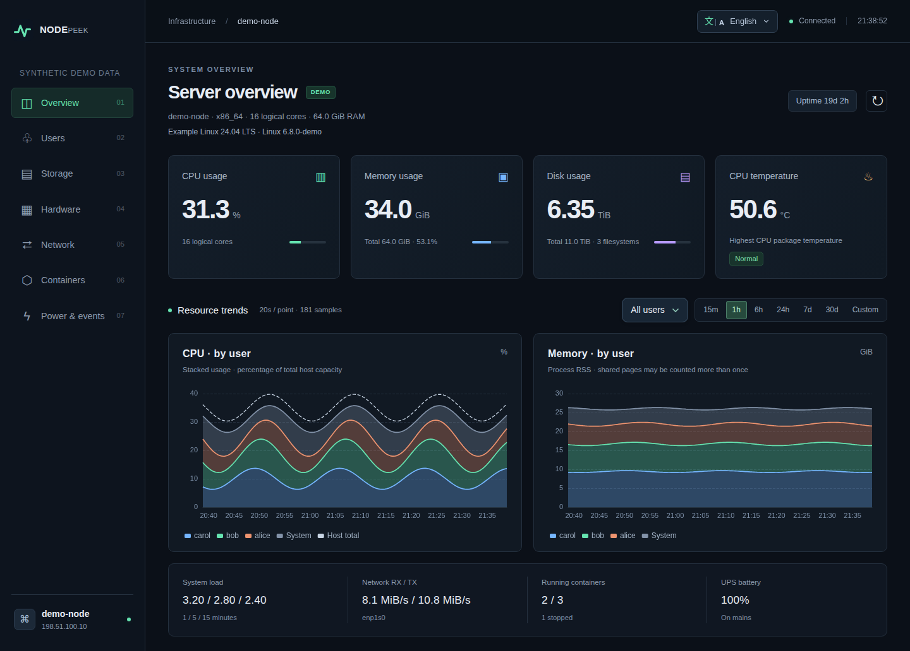
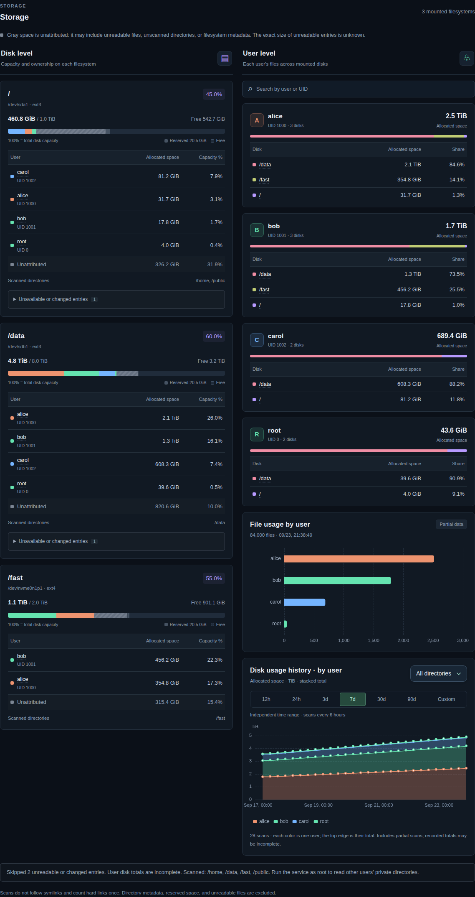
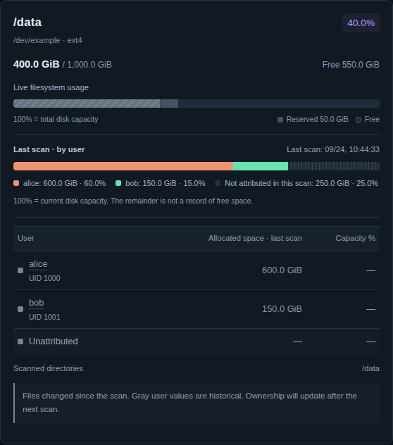
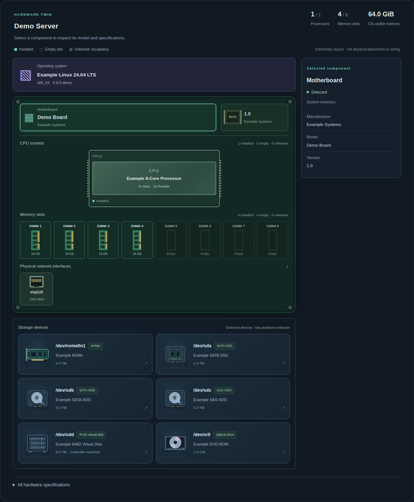
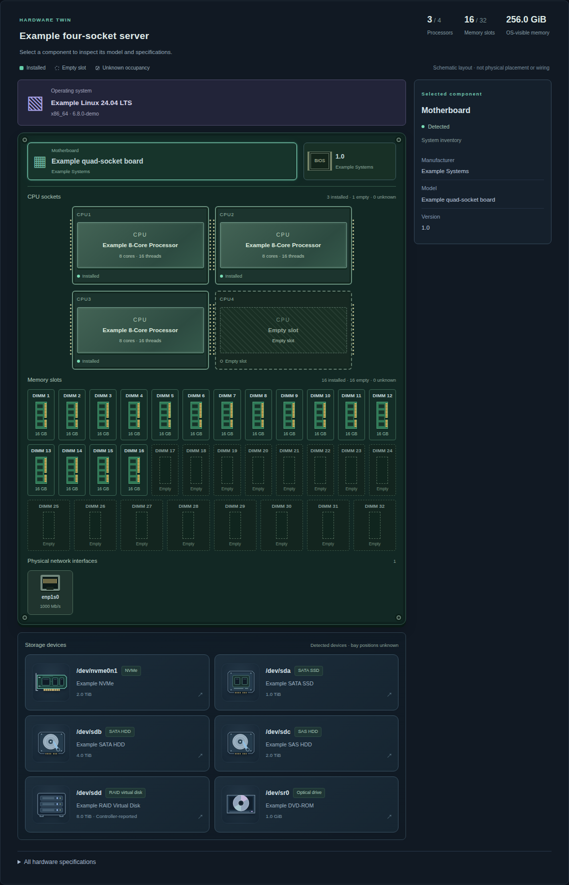
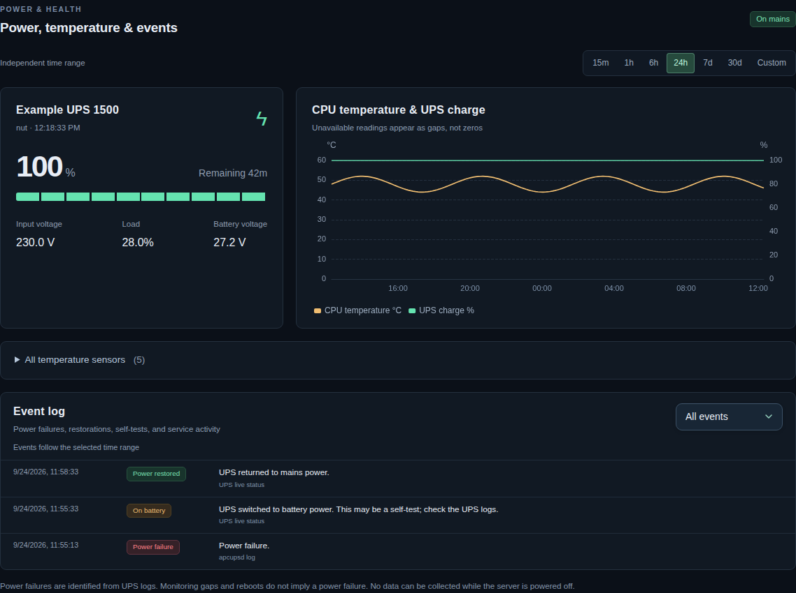
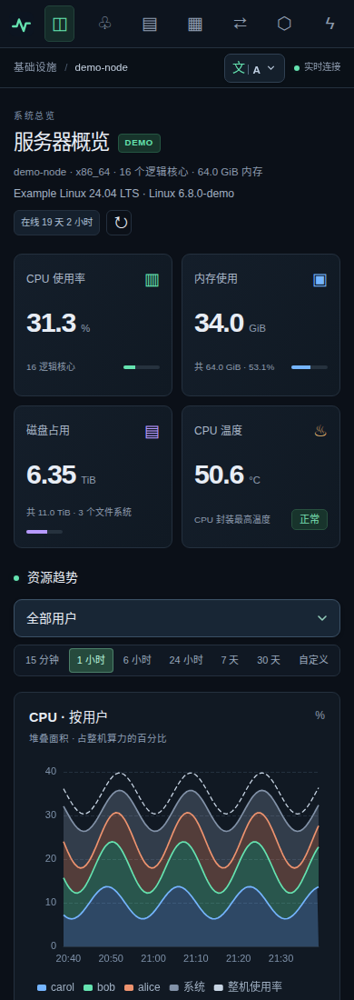

**简体中文** · [English](README.md) · [MIT 许可证](LICENSE) · [发布指南](docs/RELEASING.md)

**NodePeek** 是一个自托管 Linux 服务器监控工具，可视化记录不同用户的 CPU、内存和磁盘使用情况，同时记录网络、Docker、温度、硬件信息和 UPS 事件。数据保存在本机 SQLite 中，通过 **9100 端口**提供 HTTP 可视化页面。

不需要云账号、前端构建、CDN 或独立数据库。提供 **User Edition（无需 sudo）** 与 **Admin Edition（管理员版）**。



*文档中的全部截图由虚构示例数据生成：用户名、设备型号、资源曲线与 IP 均为演示内容，不包含真实服务器的信息。*

Network & disk I/O、Docker 与 Power 分别提供独立时间范围（15 分钟至 30 天快捷选择，支持最长 90 天自定义日期），不受顶部 Resource trends 影响。

开发流程与自动测试见[贡献指南](CONTRIBUTING.md)。仓库为 [Shall-We-Dance/NodePeek](https://github.com/Shall-We-Dance/NodePeek)，软件名为 **NodePeek**。

Power 默认显示最近 24 小时，事件列表也跟随该时间范围；温度传感器默认收起。文件在两次磁盘扫描之间变化时，仍显示实时容量，过期的用户占用标为历史值，等待下次扫描更新。

## 功能一览

| 模块 | 内容 |
| --- | --- |
| CPU / 内存 | 整机总量、按用户堆叠曲线、系统负载、进程数、可读取的进程 I/O。UID ≥ 1000 分别展示，UID < 1000 汇总为可展开的 **System**。 |
| 磁盘 | 自动发现已挂载磁盘；每块盘上各用户的占用；跨磁盘的用户卡片；独立时间范围的历史图。容量条的 **100% 始终表示整块盘容量**。 |
| 网络 | 接口流量、累计计数，标注物理网卡、ZeroTier、Docker 网桥和虚拟接口。 |
| Docker | 容器、镜像、Compose 项目、状态变化、CPU / 内存历史和可用的 I/O 数据。 |
| 硬件 | 可交互 2D 主板图，动态绘制 CPU 插槽、已装 / 空闲内存槽、物理网口、硬盘、BIOS 和操作系统；点击查看规格。 |
| 电源 / 健康 | 温度、在线时间、UPS 电量 / 续航 / 负载、市电与电池切换、apcupsd 事件记录。 |
| 界面 | 英文、中文、韩语、西班牙语、日语；**文 / A** 切换；桌面和手机布局。 |

## 选择版本

两版使用相同的界面和数据格式，区别在于运行账号的系统权限。

| | User Edition：**无 sudo** | Admin Edition：**有 sudo** |
| --- | --- | --- |
| 下载文件 | `nodepeek-1.4.1-user.tar.gz` | `nodepeek-1.4.1-admin.tar.gz` |
| 安装 / 运行 | 普通用户；拒绝以 root 运行 | sudo 安装，root 运行 |
| 程序目录 | `~/.local/share/nodepeek` | `/opt/nodepeek` |
| 配置文件 | `~/.config/nodepeek/config.toml` | `/etc/nodepeek/config.toml` |
| 历史数据 | `~/.local/state/nodepeek` | `/var/lib/nodepeek` |
| 后台服务 | 当前用户的 systemd 服务 | 系统级 systemd 服务 |
| 其他用户私有文件 / 进程 I/O | 只统计现有权限允许读取的部分 | 通常更完整，仍受文件系统限制 |
| 内存条型号 / DMI | 通常无权读取 | 有 `dmidecode` 且硬件支持时可读 |
| Docker / UPS | 取决于已有工具、套接字与服务权限 | 仍需要已有工具与服务配置 |
| 退出登录 / 重启后运行 | 取决于用户服务及 linger 策略 | 已启用的系统服务随开机启动 |

用户版目录支持 `XDG_DATA_HOME`、`XDG_CONFIG_HOME`、`XDG_STATE_HOME`。安装器不会修改 sudoers、用户组、文件访问权限、UPS 配置或网络设置。管理员版也无法保证读取远程文件系统 root-squash、不可用传感器或已变化文件。

## 安装

需要 **Linux、Python 3.11+、venv、pip**，以及首次安装 Python 依赖时的网络连接。这是可移植 Python 源码发行包，不是包含 Python / 离线依赖的独立二进制。运行软件不需要 Node.js。

从 GitHub 仓库的 **Releases** 页面下载对应压缩包和 `SHA256SUMS`，对照其中的 SHA-256 检查文件后解压。

### 普通用户版：全程不需要 sudo

```bash
tar -xzf nodepeek-1.4.1-user.tar.gz
cd nodepeek-1.4.1-user
sh install.sh
```

安装器会创建独立虚拟环境并启动当前用户的 systemd 服务。如果机器没有可用的用户 systemd 管理器，可以以前台进程运行：

```bash
sh install.sh --no-service
~/.local/share/nodepeek/start.sh
```

前台进程随会话结束而停止，除非你使用会话管理工具维持运行。用户服务在退出登录后的行为取决于机器已有的 linger 策略；安装器不会请求 sudo 来修改它。可通过 `loginctl show-user "$USER" -p Linger` 查看。

### 管理员版：sudo / root

```bash
tar -xzf nodepeek-1.4.1-admin.tar.gz
cd nodepeek-1.4.1-admin
sudo sh install.sh
```

代码会复制到 root 所有的系统目录，再安装依赖并启动 `nodepeek.service`。系统服务不会直接从普通用户可写的解压目录执行程序。没有 systemd 时，可用 `sudo sh install.sh --no-service` 安装，再用 `sudo /opt/nodepeek/start.sh` 配合自己的进程管理器运行。

查看安装计划而不写入文件：

```bash
sh install.sh --dry-run
```

如果 Python 缺少 venv 或 pip，需要先准备包含它们的 Python 环境。用户版不能绕过权限安装系统包；Debian / Ubuntu 管理员可通过系统包管理器提供 `python3-venv`。

### 打开网页

NodePeek 默认使用 **HTTP，端口为 9100**。通过服务实际监听的服务器地址访问：

```text
http://SERVER_IP:9100/
```

若希望通过服务器的任意 IPv4 网卡访问，在对应版本的配置文件中设置以下内容，然后重启服务：

```toml
[server]
host = "0.0.0.0"
port = 9100
```

也可以填入指定网卡 IP，仅监听该地址；填入 `127.0.0.1` 则仅供本机访问。现有默认值 `host = "auto"` 会选择可用的 ZeroTier IPv4，否则监听本机，实际地址见启动日志。ZeroTier 只是可选网络方式。

页面没有内置登录，路由、防火墙及 9100 端口的访问范围由你自行管理。详见[部署与数据边界](SECURITY.md)。

## 磁盘占用看得更清楚



- **Disk level：** 一条整盘容量条，包含各用户、未归属占用、保留空间和可用空间；用户百分比除以整盘总容量。
- **User level：** 按用户名或 UID 搜索，查看该用户在各盘的分布，并在磁盘和用户卡片间跳转。
- **灰色表示未知或未归属：** 无法读取、扫描时变化、未扫描的区域和文件系统统计差异不会伪装成完整的用户占用。
- **独立磁盘历史：** 默认 **7 天**；可选 **12h / 24h / 3d / 7d / 30d / 90d**，也可自定义 12 小时至 90 天。与顶部 CPU / 内存的时间范围互不影响。

默认每 6 小时在后台扫描一次磁盘。历史图每分钟刷新查询，但不会因此重新扫描文件。只有一次扫描时显示柱形，多次扫描时显示阶梯堆叠历史；不会凭空补出空白时段的数据。



删除文件后，上次扫描的用户占用可能超过实时已用空间。此时上方显示实时已用、保留和空闲容量，下方显示带时间标记的上次扫描用户占用条。两条均以当前磁盘总容量为 100%；历史条的剩余部分**不代表当时的空闲空间**。若历史记录超出当前容量，条形会截断并明确提示。

## 硬件孪生

动态适配插槽数量的可交互 2D 主板图。

独立的硬件章节提供侧栏入口，以紧凑示意图展示服务器硬件。硬盘依据系统报告的协议、旋转属性和控制器型号区分 NVMe、SATA/SAS SSD 或 HDD、RAID 虚拟硬盘等；未报告协议的 ATA 设备保留 ATA 标注，不推测 RAID 成员盘介质和物理盘位。



根据报告的槽位数量动态绘制单路、双路、四路等服务器。CPU、内存槽、主板、物理网口、硬盘、BIOS 与操作系统均可点击查看详情。已安装部件使用实心图形，确认空槽使用虚线，状态未知使用灰色斜纹。完整规格表仍可展开查看。



图形为**示意布局**，不声称还原实际物理位置或 CPU 与内存之间的接线；硬盘所在机箱槽位也不作推测。无权读取 DMI 时使用操作系统报告的处理器数量，不根据内存容量猜槽位数，不把未知状态当空槽。切换语言和刷新清单会保留所选部件。

DMI 采用字段白名单，不保留序列号、UUID、资产标签和 MAC 地址。RAID 控制器报告的型号会明确标注，不把它当成阵列内每块硬盘的型号。硬件信息在独立线程中每小时更新。

## 电源与温度



UPS 自动识别已有的 **apcupsd** 或 **NUT**，读取状态接口，并在有权限时导入 apcupsd 日志。不会配置 UPS，也不会发送关机或控制命令。监控中断、重启不自动等同于断电。

## 手机界面

<details>
<summary><strong>中文手机界面</strong></summary>



</details>

## 配置与可选工具

修改对应版本的配置文件后重启服务。完整选项见 [config.example.toml](config.example.toml)。

```toml
[server]
host = "auto"
port = 9100

[monitor]
interval = 5
raw_retention_days = 2
history_retention_days = 90
disk_scan_interval = 21600
disk_roots = ["auto"]

[ups]
backend = "auto"
nut_target = ""
apcupsd_target = "127.0.0.1:3551"
events_file = "/var/log/apcupsd.events"
```

`["auto"]` 会扫描 `/home` 和自动发现的已挂载数据文件系统，并排除系统挂载树。要加入根文件系统内的数据目录，可写 `["auto", "/fast", "/data", "/public"]`。扫描不跟随软链接、不在单个扫描根内跨文件系统，硬链接去重。

| 可选依赖 | 用途 |
| --- | --- |
| `lscpu`、`lsblk` | CPU 与存储规格 |
| `dmidecode` | 内存槽位、内存条型号和固件；通常需要 root |
| `lspci`、`lsusb` | PCI / USB 硬件 |
| `docker` 命令行 | 已有 Docker daemon 的容器状态和统计 |
| `apcaccess` 或 `upsc` | 已有 apcupsd / NUT 服务 |
| `/proc` 与 `/sys` | 进程、接口和可用的温度传感器 |

缺少可选工具不会阻止核心监控。不可用的值显示为 `—` 或灰色，并报告权限不足和部分扫描状态。

## 管理、更新与备份

| 操作 | 普通用户版 | 管理员版 |
| --- | --- | --- |
| 状态 | `systemctl --user status nodepeek` | `sudo systemctl status nodepeek` |
| 重启 | `systemctl --user restart nodepeek` | `sudo systemctl restart nodepeek` |
| 日志 | `journalctl --user -u nodepeek -n 100` | `sudo journalctl -u nodepeek -n 100` |
| 停止并禁用 | `systemctl --user disable --now nodepeek` | `sudo systemctl disable --now nodepeek` |

安装器拒绝覆盖已有的程序目录。升级时先备份数据、停止旧服务，再用 `--prefix /absolute/new/path` 安装到新目录。已有配置和历史目录会保留，服务会指向新程序路径。确认正常前保留旧程序。不要让两个采集器共用数据库或端口。切换权限版本时按 [运维指南](docs/OPERATIONS.md) 迁移目录和所有权。

在线备份请使用 SQLite backup API；也可以停止服务后复制整个数据目录。直接复制正在运行的主 `.sqlite3` 文件可能遗漏 WAL 中的数据。备份、迁移和卸载步骤见 [运维指南](docs/OPERATIONS.md)。

### 统计口径

- CPU 按整机 100% 归一化：16 线程机器上单核满载约为 6.25%。整机虚线包含未归属到可读用户进程的开销。
- 内存使用进程 **RSS**；共享页可能重复计数，不等于精确的独占物理内存。
- 默认保存 2 天原始采样和 90 天分钟 / 小时汇总。安装运行之前没有资源历史。
- 磁盘按实际分配块计算，不是文件表观长度；元数据、保留块、不可读文件会造成统计差异。
- 采样间隔内启动又结束的进程可能被遗漏，硬件与集成是否可读取决于系统和权限。

## 开发与打包

```bash
python3 -m venv .venv
.venv/bin/python -m pip install -r requirements-dev.txt
.venv/bin/python -m pytest -q
# 如有 Node.js，可运行 tests/test_*.cjs 中的前端逻辑测试。
python3 scripts/build_locales.py
python3 scripts/build_release.py
python3 scripts/verify_release.py dist
```

源码安装需要明确选择 `sh install.sh --edition user` 或 `sudo sh install.sh --edition admin`。开发运行时复制 `config.example.toml` 为 `config.toml`，再执行 `.venv/bin/python run.py --host 127.0.0.1 --port 9100`。

重新生成文档中的虚构示例截图：

```bash
.venv/bin/python -m playwright install chromium
.venv/bin/python scripts/render_readme.py
```

发布包由明确的文件白名单生成，包含两种安装包、源码 ZIP、SHA-256 校验文件和发布说明。不会递归打包正在运行的安装目录。上传步骤见 [发布指南](docs/RELEASING.md)。

## 许可证

NodePeek 原创代码采用 [MIT](LICENSE)。内置 Apache ECharts 保留 Apache-2.0 许可证，见 [第三方声明](THIRD_PARTY_NOTICES.md)。
